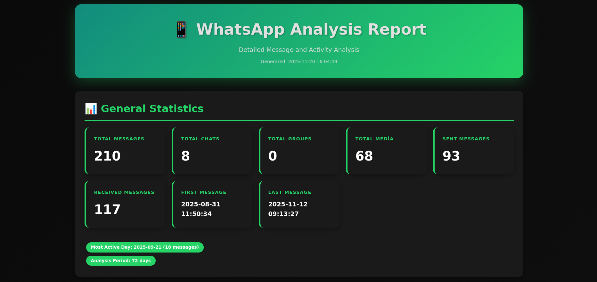
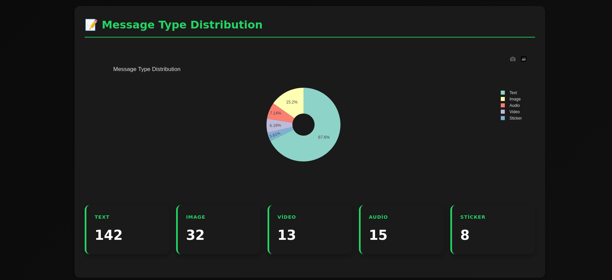
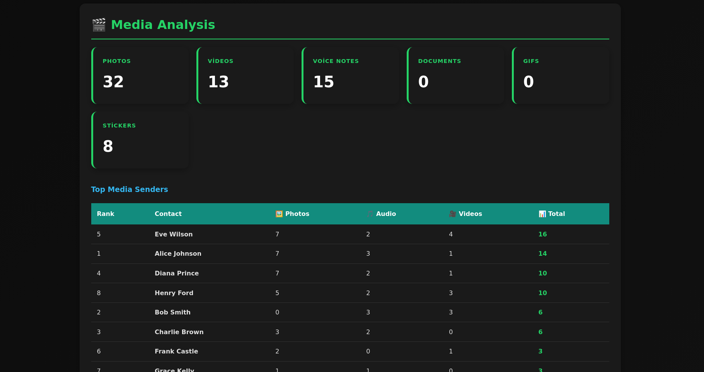
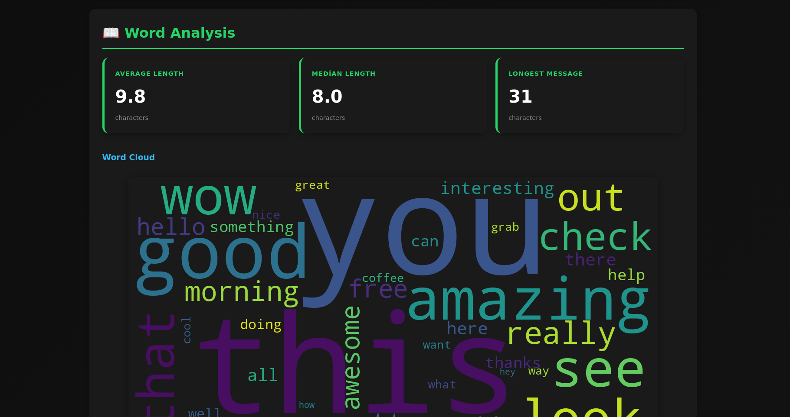
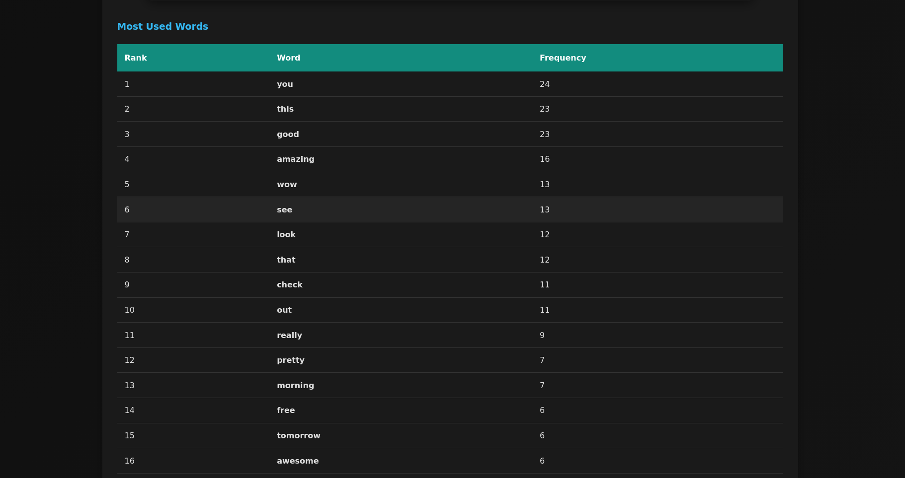
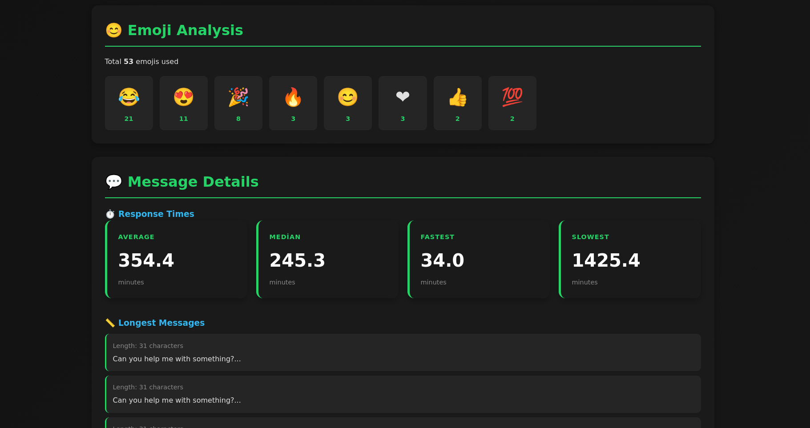
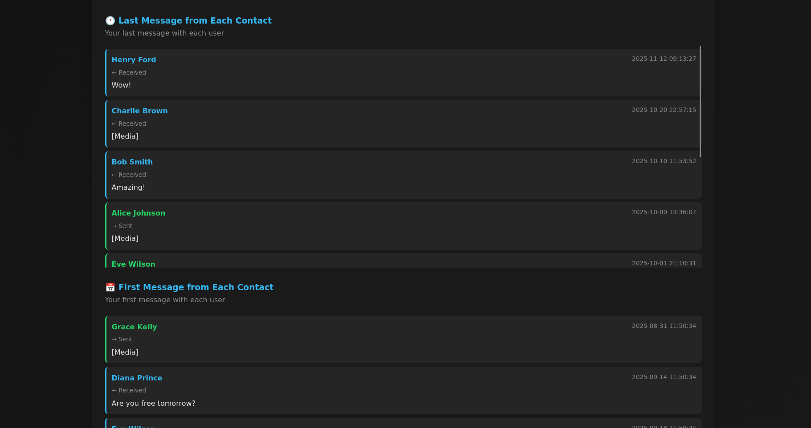
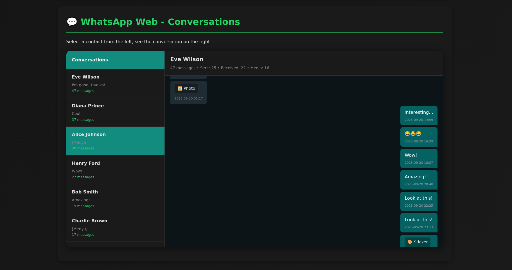

# 📱 WhatsApp Chat Analyzer With DB

A powerful, privacy-focused Python tool for analyzing WhatsApp chat history with beautiful HTML reports. Extract insights from your conversations including statistics, media analysis, emoji usage, word clouds, and interactive WhatsApp Web-style message viewing.

<div align="center">


</div>

## ✨ Features

### 📊 **Comprehensive Statistics**
- **General Analytics**: Total messages, chats, groups, media counts
- **Time Range**: First and last message dates, analysis period
- **Activity Patterns**: Most active days, hourly distributions
- **Message Distribution**: Text, photos, videos, audio, stickers, GIFs breakdown

### 💬 **Message Analysis**
- **Content Details**: Longest messages, recent conversations
- **First & Last Messages**: Per-contact message history
- **Response Time Stats**: Average, median, fastest, and slowest response times
- **Message Length**: Average length, median, longest message tracking

### 👥 **Contact Analysis**
- **Top Contacts**: Most messaged people with sent/received ratios
- **Balance Scores**: Conversation balance metrics
- **Contact Profiles**: Detailed per-contact statistics
- **WhatsApp Web UI**: Interactive chat interface for browsing conversations

### 🎬 **Media Analysis**
- **Media Breakdown**: Photos, videos, audio, documents, GIFs, stickers
- **Top Senders**: Who sends the most media (with detailed breakdowns)
- **Media Timeline**: Track media sharing over time

### 📖 **Word & Emoji Analysis**
- **Word Cloud**: Visual representation of most used words
- **Word Frequency**: Top words with usage counts
- **Emoji Statistics**: Most used emojis with frequency charts
- **Message Length**: Character count distribution

### 🎨 **Interactive Report**
- **Modern Design**: Beautiful, responsive HTML interface
- **Dark Mode**: Eye-friendly dark theme
- **Interactive Charts**: Powered by Plotly for dynamic visualizations
- **Sortable Tables**: Click to sort any column
- **WhatsApp-Style Chat**: View full conversations in familiar UI
- **Single File**: Everything embedded in one HTML file

## 📸 Screenshots

### General Statistics


### Message Type Distribution


### Media Analysis


### Word Cloud


### Emoji Analysis


### Message Details


### WhatsApp Web-Style Interface


### Conversation View


## 🔒 Privacy First

- ✅ **100% Offline**: All processing happens locally on your machine
- ✅ **No Internet Required**: No data sent to any server
- ✅ **No Cloud Storage**: Your data never leaves your device
- ✅ **Open Source**: Full transparency, audit the code yourself

## 🚀 Quick Start

### Prerequisites

- Python 3.8 or higher
- WhatsApp database files (`msgstore.db` and optionally `wa.db`)

### Installation

1. **Clone the repository**
```bash
git clone https://github.com/yourusername/whatsapp-analyzer.git
cd whatsapp-analyzer
```

2. **Install dependencies**
```bash
pip install -r requirements.txt
```

3. **Try with demo data**
```bash
# Generate demo databases
python3 create_demo_databases.py

# Create a demo report
python3 main.py demo_msgstore.db -w demo_wa.db -o demo_report.html
```

4. **Open the report**
```bash
# Open demo_report.html in your browser
```

## 📖 Usage

### Basic Usage

```bash
python3 main.py msgstore.db -o report.html
```

### With Contact Information

```bash
python3 main.py msgstore.db -w wa.db -o detailed_report.html
```

### Command Line Options

```
usage: main.py [-h] [-w WA_DB] [-o OUTPUT] msgstore_db

WhatsApp Chat Analyzer - Generate detailed analysis reports

positional arguments:
  msgstore_db           Path to msgstore.db file

optional arguments:
  -h, --help            Show this help message and exit
  -w WA_DB, --wa-db WA_DB
                        Path to wa.db file (optional, for contact names)
  -o OUTPUT, --output OUTPUT
                        Output HTML file name (default: report.html)
```

## 📁 Getting Your WhatsApp Data

### Android (Rooted)

1. Install a root file manager (e.g., Root Explorer)
2. Navigate to: `/data/data/com.whatsapp/databases/`
3. Copy these files:
   - `msgstore.db` (message database)
   - `wa.db` (contact database)

### Android (Non-Rooted via Backup)

1. Create a local WhatsApp backup (Settings → Chats → Chat backup)
2. Use [WhatsApp-Key-DB-Extractor](https://github.com/YuvrajRaghuvanshiS/WhatsApp-Key-DB-Extractor)
3. Extract `msgstore.db` and `wa.db`

### iOS

iOS WhatsApp databases are encrypted. You'll need:
1. iTunes/Finder backup (unencrypted)
2. iBackup Viewer or similar tool
3. Extract database files from backup

**Note**: This tool works with unencrypted databases only.

## 🎯 Report Sections

### 1. 📊 General Statistics
- Total messages, chats, groups, media
- Date range and analysis period
- Most active days

### 2. 📝 Message Type Distribution
- Pie chart showing message types
- Text, images, videos, audio, etc.

### 3. 🎬 Media Analysis
- Media counts by type
- Top media senders table
- Media distribution charts

### 4. 📖 Word Analysis
- Word cloud visualization
- Most frequently used words
- Message length statistics

### 5. 😊 Emoji Analysis
- Most used emojis
- Emoji frequency charts
- Usage patterns

### 6. 💬 Message Details
- Response time statistics
- Longest messages
- First and last messages per contact

### 7. 💬 WhatsApp Web - Conversations
- Interactive contact list
- Full conversation view
- Sent/received message distinction
- Media indicators

### 8. 👥 Group Analysis (if available)
- Group statistics
- Participant information
- Group activity

## 🛠️ Technical Details

### Built With

- **Python 3.8+**: Core language
- **Pandas**: Data manipulation and analysis
- **Plotly**: Interactive data visualizations
- **WordCloud**: Word cloud generation
- **SQLite3**: Database operations
- **Emoji**: Emoji extraction and analysis

### Project Structure

```
whatsapp-analyzer/
├── main.py                    # Entry point
├── database_reader.py         # Database reading logic
├── analyzer.py                # Analysis algorithms
├── report_generator.py        # HTML report generation
├── create_demo_databases.py   # Demo data generator
├── requirements.txt           # Python dependencies
├── demo_msgstore.db          # Demo message database
├── demo_wa.db                # Demo contact database
└── README.md                 # This file
```

### Database Schema Support

This tool supports modern WhatsApp database schemas including:
- Normalized `jid` table structure
- `chat_row_id` based messages
- LID (Local Identifier) mapping
- Modern message types

## 📊 Sample Output

The generated HTML report includes:

- **Statistics Cards**: Color-coded metrics
- **Interactive Charts**: Zoom, pan, hover for details
- **Sortable Tables**: Click headers to sort
- **Chat Interface**: Browse messages like WhatsApp Web
- **Responsive Design**: Works on desktop and mobile
- **Dark Theme**: Easy on the eyes

## ⚠️ Disclaimer

This tool is for personal use only. Always respect privacy and obtain consent before analyzing others' messages. The developers are not responsible for any misuse of this tool.

## 🐛 Known Issues

- Encrypted iOS backups are not supported
- Some newer WhatsApp beta features might not be recognized
- Very large databases (>1GB) may take longer to process

## 📜 License

This project is licensed under the MIT License - see the [LICENSE](LICENSE) file for details.

## 🙏 Acknowledgments

- WhatsApp for the messaging platform
- Open source community for amazing Python libraries
- Contributors and testers

## 📧 Contact

Have questions or suggestions? Open an issue on GitHub!

---

<div align="center">

**Made with ❤️ for privacy-conscious WhatsApp users**

⭐ Star this repo if you find it useful!

</div>
